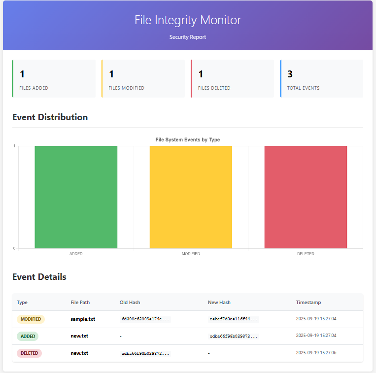
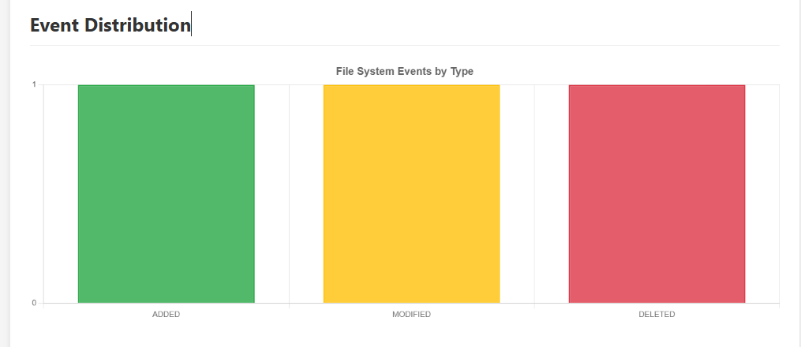
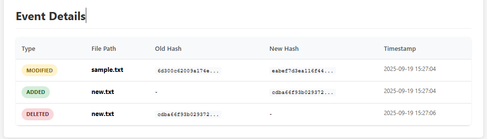

# File Integrity Monitor (FIM)

[](https://github.com/fim-team/file-integrity-monitor/actions)
[](https://codecov.io/gh/fim-team/file-integrity-monitor)
[](https://www.python.org/downloads/)
[](https://opensource.org/licenses/MIT)

A powerful command-line tool to monitor file integrity in directories using SHA256 hashing and real-time file system watching.

## Features

🔒 **Baseline Creation** - Scan directories and create SHA256 hash baselines  
👁️ **Real-time Monitoring** - Watch for file changes using efficient file system events  
📊 **HTML Reports** - Generate beautiful reports with charts and detailed event tables  
✅ **Integrity Verification** - Compare current files against saved baselines  
🐍 **Modern Python** - Built with Python 3.10+ and type hints  
🎨 **Rich Output** - Beautiful terminal output with the Rich library  

## Installation

### From PyPI (Recommended)

```bash
pip install file-integrity-monitor
```

### From Source

```bash
git clone https://github.com/fim-team/file-integrity-monitor.git
cd file-integrity-monitor
python -m venv .venv
source .venv/bin/activate  # On Windows: .venv\Scripts\activate
pip install -e .
```

### Using Docker

```bash
docker pull fim:latest
docker run --rm -v $(pwd):/workspace fim:latest --help
```

## Quick Start

### 1. Create a Baseline

Scan a directory and create a baseline of all file hashes:

```bash
fim init --path /path/to/monitor --baseline baseline.json
```

### 2. Monitor for Changes

Watch the directory for real-time changes:

```bash
fim watch --path /path/to/monitor --baseline baseline.json --events events.json
```

Press `Ctrl+C` to stop monitoring. The tool will automatically:
- Update the baseline with detected changes
- Save all events to the events file
- Generate an HTML report

### 3. Generate Reports

Create detailed HTML reports from recorded events:

```bash
fim report --events events.json --out report.html
```

### 4. Verify Integrity

Compare current files against a baseline:

```bash
fim verify --path /path/to/monitor --baseline baseline.json
```

## Usage Examples

### Basic Monitoring Workflow

```bash
# Create a virtual environment
python -m venv .venv
source .venv/bin/activate

# Install FIM
pip install file-integrity-monitor

# Initialize baseline for a directory
fim init --path examples/watchdir --baseline baseline.json

# Start monitoring (run in background or separate terminal)
fim watch --path examples/watchdir --baseline baseline.json --events events.json

# In another terminal, make some changes to files in examples/watchdir
echo "new content" > examples/watchdir/test.txt
rm examples/watchdir/old_file.txt

# Stop monitoring with Ctrl+C, then generate report
fim report --events events.json --out report.html

# Verify current state against baseline
fim verify --path examples/watchdir --baseline baseline.json
```

### Advanced Usage

#### Monitor Multiple Directories

```bash
# Create separate baselines for different directories
fim init --path /etc --baseline etc_baseline.json
fim init --path /var/log --baseline logs_baseline.json

# Monitor them separately
fim watch --path /etc --baseline etc_baseline.json --events etc_events.json &
fim watch --path /var/log --baseline logs_baseline.json --events logs_events.json &
```

#### Automated Reporting

```bash
#!/bin/bash
# monitoring_script.sh

# Start monitoring in background
fim watch --path /important/files --baseline baseline.json --events events.json &
WATCH_PID=$!

# Wait for some time or until specific condition
sleep 3600  # Monitor for 1 hour

# Stop monitoring
kill $WATCH_PID

# Generate and email report
fim report --events events.json --out daily_report.html
# mail -s "Daily FIM Report" admin@company.com < daily_report.html
```

## CLI Commands

### `fim init`

Create a baseline by scanning all files in a directory.

```bash
fim init --path <directory> --baseline <baseline_file>
```

**Options:**
- `--path`: Directory to scan (required)
- `--baseline`: Output baseline JSON file (required)

### `fim watch`

Monitor a directory for changes in real-time.

```bash
fim watch --path <directory> --baseline <baseline_file> --events <events_file>
```

**Options:**
- `--path`: Directory to monitor (required)
- `--baseline`: Baseline JSON file (required)
- `--events`: Output events JSON file (required)

**Behavior:**
- Monitors file creation, modification, deletion, and moves
- Updates baseline automatically with detected changes
- Saves events continuously
- Generates HTML report on exit (Ctrl+C)

### `fim report`

Generate HTML report from recorded events.

```bash
fim report --events <events_file> --out <output_file>
```

**Options:**
- `--events`: Input events JSON file (required)
- `--out`: Output HTML file (required)

### `fim verify`

Verify current files against a baseline.

```bash
fim verify --path <directory> --baseline <baseline_file>
```

**Options:**
- `--path`: Directory to verify (required)
- `--baseline`: Baseline JSON file (required)

**Exit Codes:**
- `0`: All files match baseline
- `2`: Integrity violations found

## File Formats

### Baseline Format (`baseline.json`)

```json
{
  "baseline": {
    "file1.txt": "a665a45920422f9d417e4867efdc4fb8a04a1f3fff1fa07e998e86f7f7a27ae3",
    "subdir/file2.txt": "b5d4045c3f466fa91fe2cc6abe79232a1a57cdf104f7a26e716e0a1e2789df78",
    "config.ini": "c3499c2729730a7f807efb8676a92dcb6f8a3f8f6c7a6e4f5d4c3b2a1098765"
  }
}
```

### Events Format (`events.json`)

```json
{
  "events": [
    {
      "type": "ADDED",
      "path": "new_file.txt",
      "old_hash": null,
      "new_hash": "d4735e3a265e16eee03f59718b9b5d03019c07d8b6c51f90da3a666eec13ab35",
      "timestamp": "2025-01-15T10:30:45.123456"
    },
    {
      "type": "MODIFIED",
      "path": "existing_file.txt",
      "old_hash": "a665a45920422f9d417e4867efdc4fb8a04a1f3fff1fa07e998e86f7f7a27ae3",
      "new_hash": "b5d4045c3f466fa91fe2cc6abe79232a1a57cdf104f7a26e716e0a1e2789df78",
      "timestamp": "2025-01-15T10:31:12.654321"
    },
    {
      "type": "DELETED",
      "path": "removed_file.txt",
      "old_hash": "c3499c2729730a7f807efb8676a92dcb6f8a3f8f6c7a6e4f5d4c3b2a1098765",
      "new_hash": null,
      "timestamp": "2025-01-15T10:32:01.987654"
    }
  ]
}
```

## HTML Reports

The generated HTML reports include:

- **Summary Cards**: Quick overview of added, modified, and deleted files
- **Interactive Charts**: Visual representation of event distribution using Chart.js
- **Detailed Table**: Complete event log with timestamps and hash information
- **Modern Design**: Responsive layout with clean, professional styling

### Report Screenshots

*Screenshots will be added here showing the HTML report interface*





## Development

### Setting Up Development Environment

```bash
# Clone the repository
git clone https://github.com/fim-team/file-integrity-monitor.git
cd file-integrity-monitor

# Create virtual environment
python -m venv .venv
source .venv/bin/activate

# Install in development mode with dev dependencies
pip install -e ".[dev]"
```

### Running Tests

```bash
# Run all tests
pytest

# Run with coverage
pytest --cov=fim --cov-report=html

# Run specific test file
pytest tests/test_hasher.py -v
```

### Code Quality

```bash
# Format code
make format

# Run linting
make lint

# Run all quality checks
make dev
```

### Project Structure

```
fim/
├── src/fim/                 # Source code
│   ├── __init__.py         # Package initialization
│   ├── __main__.py         # Entry point for python -m fim
│   ├── cli.py              # Command line interface
│   ├── models.py           # Data models
│   ├── hasher.py           # File hashing utilities
│   ├── baseline.py         # Baseline management
│   ├── storage.py          # JSON storage utilities
│   ├── watcher.py          # File system monitoring
│   ├── reporter.py         # Report generation
│   └── templates/          # Jinja2 templates
│       └── report.html.j2  # HTML report template
├── tests/                  # Test suite
│   ├── test_hasher.py      # Hash function tests
│   ├── test_baseline.py    # Baseline tests
│   └── test_reporter.py    # Report generation tests
├── examples/               # Example files
│   └── watchdir/           # Sample directory for testing
│       └── sample.txt      # Sample file
├── .github/workflows/      # CI/CD configuration
│   └── ci.yml             # GitHub Actions workflow
├── requirements.txt        # Production dependencies
├── pyproject.toml         # Project configuration
├── Makefile               # Development commands
├── Dockerfile             # Docker configuration
├── .gitignore             # Git ignore rules
├── LICENSE                # MIT license
└── README.md              # This file
```

## Dependencies

### Runtime Dependencies

- **Python 3.10+**: Modern Python with type hints
- **watchdog**: Cross-platform file system event monitoring
- **jinja2**: Template engine for HTML report generation
- **rich**: Beautiful terminal output (optional)

### Development Dependencies

- **pytest**: Testing framework
- **pytest-cov**: Coverage reporting
- **black**: Code formatting
- **isort**: Import sorting
- **flake8**: Linting
- **mypy**: Type checking

## Contributing

1. Fork the repository
2. Create a feature branch (`git checkout -b feature/amazing-feature`)
3. Make your changes
4. Run tests and quality checks (`make dev`)
5. Commit your changes (`git commit -m 'Add amazing feature'`)
6. Push to the branch (`git push origin feature/amazing-feature`)
7. Open a Pull Request

## Security Considerations

- **Hash Algorithm**: Uses SHA256 for cryptographic integrity verification
- **File Permissions**: Respects file system permissions and handles access errors gracefully
- **Path Traversal**: Prevents directory traversal attacks by validating paths
- **Resource Usage**: Implements efficient chunk-based file reading to handle large files

## Performance

- **Memory Efficient**: Processes files in chunks to minimize memory usage
- **Fast Hashing**: Uses optimized SHA256 implementation
- **Event-Driven**: Leverages OS-level file system events for real-time monitoring
- **Scalable**: Handles directories with thousands of files efficiently

## License

This project is licensed under the MIT License - see the [LICENSE](LICENSE) file for details.

## Changelog

### v1.0.0 (2025-01-15)

- Initial release
- Core functionality for baseline creation, monitoring, reporting, and verification
- HTML report generation with Chart.js integration
- Docker support
- Comprehensive test suite
- CI/CD pipeline

## Support

- **Email**: ngv.chungg@gmail.com

## Acknowledgments

- Built with [Watchdog](https://github.com/gorakhargosh/watchdog) for file system monitoring
- UI components inspired by modern security dashboards
- Chart visualization powered by [Chart.js](https://www.chartjs.org/)

---

**File Integrity Monitor** - Keeping your files secure, one hash at a time. 🔒
